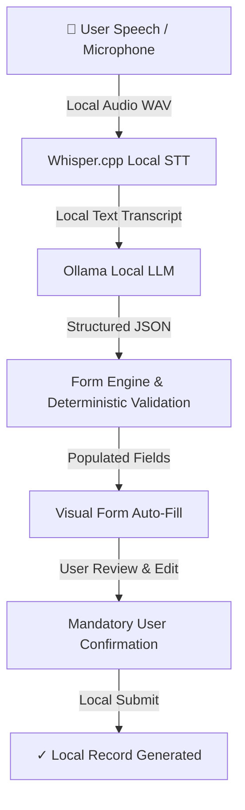

# VaaniForm 🎤📋
> *"Speak. Watch it fill. Confirm."*

**VaaniForm** is an offline-first, voice-first form-filling assistant designed to empower millions of citizens across India to complete everyday paperwork—government applications, job forms, medical intake—using natural spoken language without relying on cloud AI APIs or leaking personal data.

---

## 🔒 Privacy & Offline Architecture

VaaniForm is engineered with **zero cloud dependencies**:
- **No Cloud Speech APIs**: Speech-to-text is performed completely locally via **Whisper.cpp**.
- **No Cloud LLM APIs**: Field extraction and transcript understanding are powered locally by **Ollama** (`gemma3:4b` or configurable models).
- **No External Data Storage**: Personal data never leaves the local device.



---

## 🛠️ Tech Stack

- **Frontend**: React (Vite), Tailwind CSS v4, Lucide React Icons
- **Backend**: Python 3.14, FastAPI, Pydantic v2, Uvicorn
- **Speech-to-Text**: Whisper.cpp (Local CLI / GGML models)
- **Local LLM**: Ollama (`gemma3:4b` default)
- **Data Format**: JSON Form Schemas & Structured Payloads

---

## 🚀 Quick Start & Installation

### 1. Environment Verification
Run the PowerShell environment checker:
```powershell
.\scripts\check_environment.ps1
```

### 2. Install Project Dependencies
Run the automated setup script to create the Python virtual environment and install frontend npm packages:
```powershell
.\scripts\setup.ps1
```

Or manually:
```powershell
# Backend virtualenv setup
cd backend
python -m venv venv
venv\bin\python -m pip install -r requirements.txt   # (Or venv\Scripts\pip install -r requirements.txt)

# Frontend setup
cd ..\frontend
npm install
```

---

## 🤖 Local AI Services Setup

### Ollama Setup
1. Download & install Ollama from [https://ollama.com](https://ollama.com).
2. Pull the default model:
   ```cmd
   ollama pull gemma3:4b
   ```
3. Start the Ollama local service:
   ```cmd
   ollama serve
   ```

### Whisper.cpp Setup
1. Clone & build Whisper.cpp:
   ```cmd
   git clone https://github.com/ggerganov/whisper.cpp.git c:\whisper.cpp
   cd c:\whisper.cpp
   cmake -B build
   cmake --build build --config Release
   ```
2. Download base model:
   ```cmd
   .\models\download-ggml-model.cmd base
   ```
3. Configure environment variable in `.env`:
   ```ini
   WHISPER_EXECUTABLE_PATH=c:\whisper.cpp\build\bin\Release\main.exe
   WHISPER_MODEL_PATH=c:\whisper.cpp\models\ggml-base.bin
   ```

---

## 🏃 Running VaaniForm

### Start Backend API Server
```powershell
cd backend
venv\bin\python -m uvicorn app.main:app --reload --port 8000
# OR on Windows CMD: venv\Scripts\uvicorn app.main:app --reload --port 8000
```
Backend will start on `http://localhost:8000`. Test health status at `http://localhost:8000/health`.

### Start Frontend UI Server
In a new terminal:
```powershell
cd frontend
npm run dev
```
Frontend will start on `http://localhost:5173`.

---

## 🧪 Automated Testing

Run the automated Pytest suite and Vite build verification:
```powershell
.\scripts\test_pipeline.ps1
```

---

## 🎬 Demo Instructions (Hackathon Flow)

1. Open `http://localhost:5173` in Google Chrome or Microsoft Edge.
2. Select **Citizen Service Application**.
3. Click **"Try Demo"** to run the pipeline using sample speech transcript:
   > *"My name is Ananya Sharma. My date of birth is 12 March 2004. My phone number is 9876543210. I live in Hyderabad, Telangana. I am a student."*
4. Observe the step progress (`SPEAK` → `UNDERSTAND` → `FILL` → `REVIEW`).
5. Review extracted values with confidence badges (`✓ Detected`, `⚠ Please verify`).
6. Edit any field directly if desired.
7. Click **"CONFIRM & SUBMIT"** to generate the local submission record.
